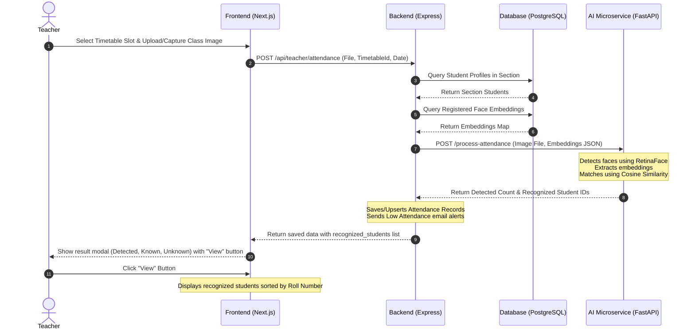
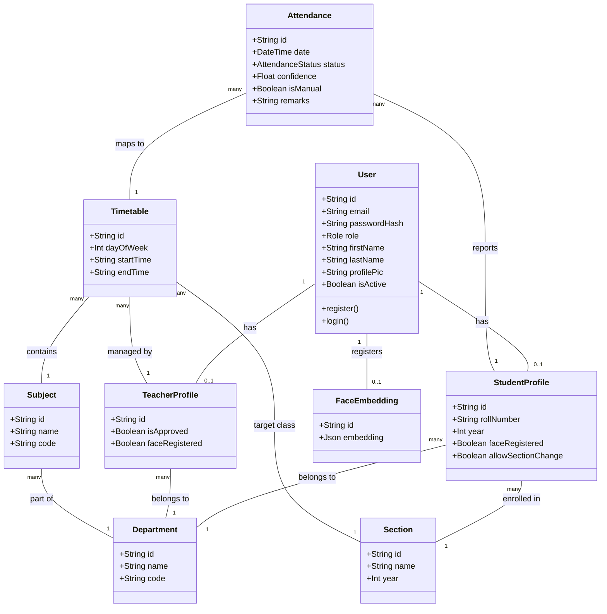

# PROJECT REPORT: AI-Powered Image Processing Attendance Management System (Attendify)

---

## Abstract

Traditional systems for managing student attendance, such as paper-based registers, manual digital forms, or card scans, are inefficient, time-consuming, and highly vulnerable to proxy attendance ("buddy punching"). This project introduces **Attendify**, an AI-powered image processing attendance management system designed to automate classroom attendance capture. By utilizing group classroom photographs, the system detects, registers, and tracks student presence autonomously. 

The architecture is split into three main parts: a responsive Next.js frontend interface for admins, teachers, and students; a Node.js/Express backend API coordinating business logic and database persistence via Prisma ORM to a Supabase PostgreSQL instance; and a Python FastAPI microservice executing multi-face detection (RetinaFace) and feature embedding extraction/comparison (InsightFace). 

This report provides a detailed overview of the system's design, requirement analysis, database design, UML diagrams, implementation stages, test validation results, and a comprehensive user guide.

---

## Acknowledgement

We extend our heartfelt appreciation to all those who have contributed to the development and success of our academic attendance system, **Attendify**.

We would like to express our deepest gratitude to the academic faculty members whose guidance and support have been invaluable throughout the development process. Their expertise, mentorship, and encouragement have provided us with the necessary guidance and resources to navigate the complexities of web application development, machine learning microservices, and modern database management.

We would like to acknowledge the invaluable information and inspiration drawn from various educational platforms, open-source repositories, and the computer vision research community. These resources proved to be a rich source of ideas and insights into the practical implementation of facial recognition models.

Additionally, we are grateful for the existence of open-source and modern cloud technologies like **Next.js**, **React**, **Node.js**, **Express**, **Python (FastAPI)**, **Supabase (PostgreSQL)**, and **Prisma ORM**. These tools provided a powerful foundation for building this web application.

Last but not least, we extend our sincere appreciation to our users and testers for their anticipated support and feedback. Their engagement and enthusiasm will be vital in driving the ongoing improvement and refinement of our application.

---

## Table of Contents
1. [Introduction](#1-introduction)
   - [1.1 Motivation](#11-motivation)
   - [1.2 Problem Statement](#12-problem-statement)
   - [1.3 Project Objectives](#13-project-objectives)
2. [Requirement Analysis](#2-requirement-analysis)
   - [2.1 Functional Requirements](#21-functional-requirements)
   - [2.2 Non-Functional Requirements](#22-non-functional-requirements)
   - [2.3 Software Requirements](#23-software-requirements)
   - [2.4 Hardware Requirements](#24-hardware-requirements)
3. [UML Diagrams](#3-uml-diagrams)
   - [3.1 Use Case Diagram](#31-use-case-diagram)
   - [3.2 Sequence Diagram](#32-sequence-diagram)
   - [3.3 Class Diagram](#33-class-diagram)
   - [3.4 Schema Diagram (Entity-Relationship)](#34-schema-diagram-entity-relationship)
4. [Project Design and Development](#4-project-design-and-development)
   - [4.1 Development Methodology](#41-development-methodology)
   - [4.2 Step-by-Step Breakdown](#42-step-by-step-breakdown)
   - [4.3 Benefits of Our Methodology](#43-benefits-of-our-methodology)
5. [Tools and Technologies (Comparative Analysis)](#5-tools-and-technologies-comparative-analysis)
   - [5.1 Frontend: Next.js vs. React (Vite) / Angular / Vue](#51-frontend-nextjs-vs-react-vite--angular--vue)
   - [5.2 Styling: Tailwind CSS vs. Vanilla CSS / Material-UI / Bootstrap](#52-styling-tailwind-css-vs-vanilla-css--material-ui--bootstrap)
   - [5.3 Backend: Node.js/Express vs. Python (Django/Flask) / Java (Spring Boot)](#53-backend-nodejsexpress-vs-python-djangoflask--java-spring-boot)
   - [5.4 Database Interface: Prisma ORM vs. TypeORM / Sequelize / Raw SQL](#54-database-interface-prisma-orm-vs-typeorm--sequelize--raw-sql)
   - [5.5 Database: PostgreSQL (Supabase) vs. MySQL / MongoDB](#55-database-postgresql-supabase-vs-mysql--mongodb)
   - [5.6 AI Service: FastAPI vs. Flask / Django REST Framework](#56-ai-service-fastapi-vs-flask--django-rest-framework)
   - [5.7 Core CV Models: InsightFace/RetinaFace vs. OpenCV Haar / Dlib / MediaPipe](#57-core-cv-models-insightfaceretinaface-vs-opencv-haar--dlib--mediapipe)
6. [Project Phases](#6-project-phases)
7. [Testing](#7-testing)
   - [7.1 Unit Testing](#71-unit-testing)
   - [7.2 Integration Testing](#72-integration-testing)
   - [7.3 Functional Testing](#73-functional-testing)
   - [7.4 Usability Testing](#74-usability-testing)
   - [7.5 Performance Testing](#75-performance-testing)
   - [7.6 Regression Testing](#76-regression-testing)
   - [7.7 User Acceptance Testing (UAT)](#77-user-acceptance-testing-uat)
8. [User Guide](#8-user-guide)
9. [Conclusion](#9-conclusion)
10. [References](#10-references)
11. [Appendix](#11-appendix)

---

## 1. Introduction

### 1.1 Motivation
In academic institutions worldwide, marking attendance is a mandatory daily routine that consumes a significant amount of classroom time. Manual methods are slow and prone to errors. Furthermore, classroom attendance directly affects student academic performance and retention. Implementing an automated, biometric-based system saves administrative overhead and allows teachers to spend more time lecturing.

### 1.2 Problem Statement
Traditional manual attendance procedures suffer from several key issues:
1. **Inefficiency:** Taking attendance verbally for a class of 60+ students consumes 10-15 minutes of a 60-minute lecture.
2. **Proxy Attendance:** Students frequently sign paper sheets or mark online links on behalf of absent classmates.
3. **Data Silos & Analytics:** Manual registers make it difficult to run real-time statistics or identify students whose attendance falls below the minimum required threshold (typically 75%).
4. **Error-prone Records:** Data entry errors during manual recording lead to discrepancies.

### 1.3 Project Objectives
The core goals of the **Attendify** project are:
* Develop an automated system that registers attendance for an entire classroom via a single group photo.
* Create secure registration workflows where students register their unique biometric face embeddings.
* Offer granular role-based dashboard access for three main user segments: Admins, Teachers, and Students.
* Automatically send email alerts to students when their subject attendance percentage drops below 75%.
* Enable teachers to manually override and review attendance results, with options to download CSV reports.

---

## 2. Requirement Analysis

### 2.1 Functional Requirements
* **FR-1: User Management & Authentication:** Secure registration and login for Admins, Teachers, and Students. Role-based routing protects resources.
* **FR-2: Biometric Face Registration:** Students upload or capture a single high-quality portrait to extract and register their facial embedding vector in the database.
* **FR-3: Timetable & Session Management:** Teachers schedule specific lecture slots mapping to a Subject, Section (Class), and Time.
* **FR-4: Group Attendance Recognition:** Teachers upload/capture a group photo of the classroom. The AI service processes all faces, matches them against the section's student embeddings, and registers presence.
* **FR-5: Manual Override:** Teachers can manually review and edit attendance records to handle edge cases.
* **FR-6: Dynamic Attendance List Viewing:** Teachers can click "View" beside the recognized faces count to see a list of recognized students, sorted by their roll number.
* **FR-7: Automated Low-Attendance Alerts:** The system computes the student's attendance percentage for the subject and dispatches an email notification if it falls below 75%.
* **FR-8: Data Exporting:** Teachers and Admins can export attendance histories to downloadable CSV formats.

### 2.2 Non-Functional Requirements
* **NFR-1: Security:** User passwords must be hashed using bcrypt. JWT tokens must be stored in secure HTTP-only cookies to prevent cross-site scripting (XSS) attacks.
* **NFR-2: Accuracy:** Facial recognition must achieve a high accuracy rate with low false positives using a cosine similarity threshold of 0.5.
* **NFR-3: Scalability:** The backend and AI microservice must process classrooms with up to 100+ concurrent face detections within 5 seconds.
* **NFR-4: Usability:** Responsive, dark-themed user interface utilizing glassmorphic aesthetics, fluid micro-animations, and clean typographic scaling.

### 2.3 Software Requirements
* **Operating System:** cross-platform (Windows, macOS, Linux)
* **Frontend Framework:** Next.js (version 14.2.3), React (version 18), Tailwind CSS, Framer Motion
* **Backend Runtime:** Node.js (v20+), Express.js (v4.19.2)
* **ORM:** Prisma Client (v5.14.0)
* **Database Engine:** PostgreSQL (Supabase cloud host)
* **AI Service Framework:** Python (v3.10+), FastAPI, Uvicorn
* **Computer Vision Libraries:** OpenCV, numpy, InsightFace, RetinaFace, ONNX Runtime

### 2.4 Hardware Requirements
* **Development Workstation:** Minimum Core i5 or Apple M-series processor, 8GB RAM (16GB recommended for running AI models locally).
* **Database Server:** Supabase Cloud hosting container.
* **Camera Sensor:** Minimum 720p HD webcam or smartphone camera integration for capturing clear group photos.

---

## 3. UML Diagrams

### 3.1 Use Case Diagram
The system defines interactions between three primary actors: Admin, Teacher, and Student.

```mermaid
leftToRightDirection
actor Admin
actor Teacher
actor Student

rectangle AttendifySystem {
  usecase "Authenticate Users" as UC_Auth
  usecase "Manage Departments & Sections" as UC_ManageEntities
  usecase "Approve Teacher Registrations" as UC_ApproveTeacher
  usecase "Schedule Timetable Slots" as UC_ScheduleSlot
  usecase "Upload Classroom Image" as UC_UploadClass
  usecase "Process AI Facial Recognition" as UC_ProcessAI
  usecase "View Recognized Students list (Sorted)" as UC_ViewList
  usecase "Manually Edit Attendance Status" as UC_ManualEdit
  usecase "Register Portrait & Biometrics" as UC_RegisterBiometrics
  usecase "View Individual Attendance Analytics" as UC_ViewStats
}

Admin --> UC_Auth
Admin --> UC_ManageEntities
Admin --> UC_ApproveTeacher

Teacher --> UC_Auth
Teacher --> UC_ScheduleSlot
Teacher --> UC_UploadClass
Teacher --> UC_ViewList
Teacher --> UC_ManualEdit

Student --> UC_Auth
Student --> UC_RegisterBiometrics
Student --> UC_ViewStats

UC_UploadClass .> UC_ProcessAI : <<include>>
```

---

### 3.2 Sequence Diagram
The following sequence diagram represents the workflow of capturing and processing classroom attendance.



---

### 3.3 Class Diagram
A structural class diagram illustrating models and controller layers.



---

### 3.4 Schema Diagram (Entity-Relationship)
Here is the dynamic schema representation generated through Prisma ORM mapping.

```mermaid
erDiagram
    USER ||--|| ADMIN-PROFILE : "owns"
    USER ||--|| TEACHER-PROFILE : "owns"
    USER ||--|| STUDENT-PROFILE : "owns"
    USER ||--|| FACE-EMBEDDING : "registers"
    DEPARTMENT ||--o{ SUBJECT : "offers"
    DEPARTMENT ||--o{ TEACHER-PROFILE : "hires"
    DEPARTMENT ||--o{ STUDENT-PROFILE : "enrolls"
    SECTION ||--o{ STUDENT-PROFILE : "contains"
    TIMETABLE }|--|| TEACHER-PROFILE : "assigned"
    TIMETABLE }|--|| SUBJECT : "covers"
    TIMETABLE }|--|| SECTION : "schedules"
    ATTENDANCE }|--|| STUDENT-PROFILE : "records student"
    ATTENDANCE }|--|| TIMETABLE : "records session"
    QR-REGISTRATION }|--|| STUDENT-PROFILE : "tracks student"
    QR-REGISTRATION }|--|| TIMETABLE : "tracks session"

    USER {
        string id PK
        string email UNIQUE
        string passwordHash
        Role role
        string firstName
        string lastName
        string profilePic
        boolean isActive
    }

    STUDENT-PROFILE {
        string id PK
        string userId FK
        string rollNumber UNIQUE
        string departmentId FK
        string sectionId FK
        int year
        boolean faceRegistered
        boolean allowSectionChange
    }

    TEACHER-PROFILE {
        string id PK
        string userId FK
        string departmentId FK
        boolean isApproved
        boolean faceRegistered
    }

    TIMETABLE {
        string id PK
        int dayOfWeek
        string startTime
        string endTime
        string teacherId FK
        string subjectId FK
        string sectionId FK
    }

    ATTENDANCE {
        string id PK
        string studentId FK
        string timetableId FK
        datetime date
        AttendanceStatus status
        float confidence
        boolean isManual
        string remarks
    }
```

---

## 4. Project Design and Development

### 4.1 Development Methodology
The project adopted the **Agile Development Methodology** with iterative, component-level releases. This allowed us to build the machine learning models and structural backend logic concurrently while continuously polishing and integrating the user interface layers.

### 4.2 Step-by-Step Breakdown
1. **Database Schema Design:** We established structural normalization, defining relationships between User schemas and customized profiles.
2. **AI Microservice Construction:** We containerized InsightFace and OpenCV logic into a FastAPI setup to expose clean REST endpoints (`/register-face` and `/process-attendance`).
3. **Core API Implementation:** Express routes were configured for authorization, admin registration, section building, and automatic low-attendance email dispatch.
4. **Responsive Frontend Composition:** Built using Next.js with high-fidelity, interactive components including camera controllers and statistics charts.

### 4.3 Benefits of Our Methodology
* **Early Defect Detection:** Testing APIs concurrently with UI integration minimized breaking changes.
* **Modular Services:** Keeping the AI processing logic in a FastAPI Python microservice decoupled it from the Node.js server, allowing us to manage compute resources efficiently.

---

## 5. Tools and Technologies (Comparative Analysis)

To achieve a modern, scalable, and highly performant architecture, each architectural layer was chosen after evaluating multiple mainstream solutions. Below is a comprehensive analysis of our final software selections.

```
                  ┌──────────────────────────────────────────┐
                  │          NEXT.JS FRONTEND PORTAL         │
                  │   Utility-first styles with Tailwind     │
                  └──────────────────────────────────────────┘
                                       │
                        API Queries    │   JSON Requests
                        & JWT Cookies  ▼   (Credentials)
                  ┌──────────────────────────────────────────┐
                  │           EXPRESS.JS BACKEND             │
                  │   Prisma ORM Database Access Layer       │
                  └──────────────────────────────────────────┘
                        │                      ▲
              Prisma    │                      │   HTTP multipart/form-data
              Queries   ▼                      │   with facial embeddings
                  ┌───────────┐          ┌───────────────────────────┐
                  │ SUPABASE  │          │   FASTAPI AI SERVICE      │
                  │  (Postgres│          │   InsightFace + RetinaFace│
                  └───────────┘          └───────────────────────────┘
```

---

### 5.1 Frontend: Next.js vs. React (Vite) / Angular / Vue

| Parameter | Next.js (Our Choice) | React (Vite) | Angular | Vue.js |
| :--- | :--- | :--- | :--- | :--- |
| **Routing** | File-system-based (App Router) | Client-side (needs React Router) | Built-in router | Router module (Vue Router) |
| **Optimization** | Automatic image & link optimization | Developer-configured | Compiler optimization | Developer-configured |
| **SSR/Static Export** | Out-of-the-box (flexible deployment) | Difficult setup | Complex configuration | Complex configuration |
| **Initial Loading** | Fast (pre-rendered components) | Medium (large client bundles) | Slow (heavy framework size) | Fast (light weight) |

* **Why we chose Next.js:**
  Although raw React (via Vite) is excellent for standard Single Page Applications (SPAs), **Next.js** provides a highly structured directory system (App Router) that simplifies layout reuse across nested dashboards (Admins, Teachers, and Students). Next.js's native asset optimizer handles visual compression for loaded profile icons automatically. Furthermore, its static export compiler (`output: 'export'`) allows us to compile the client-side code directly into pure static HTML/CSS/JS, enabling low-cost, zero-maintenance deployment to Firebase Hosting CDN points.
  Compared to **Angular**, Next.js has a simpler structure and utilizes React's declarative syntax, allowing us to build interactive UI widgets quickly. Compared to **Vue**, React's ecosystem offers more comprehensive UI animation libraries (such as Framer Motion) which we leveraged to build the dark-glass dashboards.

---

### 5.2 Styling: Tailwind CSS vs. Vanilla CSS / Material-UI / Bootstrap

| Parameter | Tailwind CSS (Our Choice) | Vanilla CSS | Material-UI (MUI) | Bootstrap |
| :--- | :--- | :--- | :--- | :--- |
| **Utility Bloat** | Low (compiled CSS only uses active classes) | Low | High (heavy JS-in-CSS injection) | High |
| **Development Speed** | High (in-line styling utility classes) | Low (constant file switching) | Medium (preset component config) | High (preset layout components) |
| **Theme Control** | Complete (atomic config mappings) | Complex variables | Theme provider overrides | Sass variables configuration |
| **Aesthetics Style** | Bespoke / Custom SaaS layouts | Bespoke | Standardized Google Material | Standard template grids |

* **Why we chose Tailwind CSS:**
  Rather than using legacy grid template engines like **Bootstrap** (which leads to generic-looking sites and requires loading large CSS stylesheets), **Tailwind CSS** compiles only the classes used in our markup. This results in minimal production CSS file sizes.
  Compared to component frameworks like **Material-UI (MUI)**, Tailwind does not bind us to rigid design patterns (such as Google Material Design). It gives us total control to create modern dark-mode layouts, HSL gradient text, and custom glassmorphism components (`backdrop-filter`).
  Compared to **Vanilla CSS**, Tailwind speeds up development. It eliminates the need to switch between markup and external stylesheets, and native utility prefixes like `dark:` and `hover:` make styling states straightforward.

---

### 5.3 Backend: Node.js/Express vs. Python (Django/Flask) / Java (Spring Boot)

| Parameter | Node.js/Express (Our Choice) | Python (Django) | Java (Spring Boot) |
| :--- | :--- | :--- | :--- |
| **Concurrency Mode** | Event-driven async non-blocking I/O | Synchronous (needs gevent/uvicorn) | Multi-threaded blocking (thread per request) |
| **Language Uniformity**| TypeScript / JavaScript (shared with client) | Python | Java |
| **Boot Time** | Extremely fast (<100ms) | Fast | Slow (heavy dependency injection) |
| **Memory Overhead** | Low (lightweight V8 runtime loop) | Medium | High (requires JVM garbage collector) |

* **Why we chose Node.js/Express:**
  Marking classroom attendance involves multiple simultaneous requests (e.g. database checks, email notifications, and communication with the AI microservice). **Node.js**'s single-threaded event loop processes non-blocking I/O operations asynchronously, making it well-suited for handling high-concurrency requests.
  Compared to **Java Spring Boot**, Node.js starts much faster and consumes far less memory, making it more cost-effective for hosting.
  While **Django** provides a robust administrative module, its heavy structure makes it less ideal for building decoupled backend API microservices. Writing the backend in TypeScript also allowed us to share data models and validation functions between the frontend and backend, reducing developer overhead.

---

### 5.4 Database Interface: Prisma ORM vs. TypeORM / Sequelize / Raw SQL

| Parameter | Prisma ORM (Our Choice) | TypeORM | Sequelize | Raw SQL (pg-pool) |
| :--- | :--- | :--- | :--- | :--- |
| **Type Safety** | Auto-generated TS types based on Schema | Decoupled decorator definitions | Weak JS class models | Manual runtime interface mapping |
| **Developer Speed** | High (clean, readable schema.prisma) | Medium (complex mapping logic) | Medium | Low (manual query construction) |
| **Query Performance** | Optimized Engine (compiled Rust binary) | Medium | Medium | Extremely High |
| **Migrations Control** | Integrated prisma migrate CLI tools | Manual sync | Migrator scripts | Manual SQL execution scripts |

* **Why we chose Prisma ORM:**
  Writing raw SQL queries (using `pg-pool`) is highly performant but increases the risk of syntax errors, and it requires mapping database responses to TypeScript types manually. **Prisma ORM** solves this by generating a type-safe client automatically from our database schema.
  Compared to **Sequelize** or **TypeORM**, Prisma uses a clear, central declarative schema file (`schema.prisma`). It features an automated database migrator and compiled query builder engines written in Rust, which optimize SQL queries for better performance.

---

### 5.5 Database: PostgreSQL (Supabase) vs. MySQL / MongoDB

| Parameter | PostgreSQL (Our Choice) | MySQL | MongoDB (NoSQL) |
| :--- | :--- | :--- | :--- |
| **Data Integrity** | ACID Compliant, Strict Foreign Keys | ACID Compliant | Document-based (no strict schema) |
| **Query Complexity** | Advanced Joins and aggregations | Standard SQL Joins | Nested aggregation pipelines |
| **AI Vector Storage** | Supported (via pgvector) | Poor native support | Vector search index |
| **Relation Mapping** | Excellent (Timetable -> Section -> Students) | Good | Poor (requires manual referencing) |

* **Why we chose PostgreSQL (Supabase):**
  Academic data structures are inherently relational: students are enrolled in Sections, Sections mapped to Timetables, and Attendance records link to both. **PostgreSQL** guarantees referential integrity, preventing anomalies like registering attendance for a student who does not exist.
  Compared to **MongoDB**, which uses unstructured document stores, Postgres enforces a strict schema. This is essential for financial or academic systems where database consistency is critical.
  Supabase provides an optimized PostgreSQL engine, built-in connection poolers (`pgbouncer`), and compatibility with `pgvector` for storing and matching face embeddings directly in the database if needed.

---

### 5.6 AI Service: FastAPI vs. Flask / Django REST Framework

| Parameter | FastAPI (Our Choice) | Flask | Django REST Framework |
| :--- | :--- | :--- | :--- |
| **Performance** | High (comparable to Go/Node due to ASGI) | Low (synchronous thread blocking) | Low (synchronous REST routing) |
| **Type Validation** | Automatic (via Pydantic integrations) | Manual payload parsing | DRF Serializer components |
| **Auto API Docs** | Out-of-the-box (Swagger & Redoc views) | Third-party libraries required | Third-party libraries required |
| **Execution Mode** | Asynchronous (async/await event loops) | Synchronous | Synchronous |

* **Why we chose FastAPI:**
  AI model operations (like face detection and embedding generation) are CPU-bound, but network requests to the AI service are I/O-bound. **FastAPI** uses an Asynchronous Server Gateway Interface (ASGI) to handle requests asynchronously, preventing blocking.
  Compared to **Flask**, FastAPI includes automatic payload validation (via Pydantic) and auto-generates interactive Swagger documentation. This allowed us to quickly test the `/process-attendance` endpoint during development.

---

### 5.7 Core CV Models: InsightFace/RetinaFace vs. OpenCV Haar / Dlib / MediaPipe

| Parameter | InsightFace / RetinaFace (Our Choice) | OpenCV Haar Cascades | Dlib HOG / ResNet | MediaPipe Face Mesh |
| :--- | :--- | :--- | :--- | :--- |
| **Multi-Face Detection**| Excellent (detects dozens of faces in one image) | Poor (fails with occlusion/crowds) | Medium (slow on large groups) | Medium (tuned for single-person selfie) |
| **Pose & Angle Variance**| Robust (accurate up to 90-degree yaw angles) | Poor (requires direct frontal camera view) | Medium | Medium (restricted tracking depth) |
| **Feature Dimension** | 512-Dimensional feature embedding vector | N/A (simple geometric ratios) | 128-Dimensional vector | 3D coordinate point maps |
| **Embedding Speed** | Fast (onnx runtime execution engine) | Fast | Slow (without GPU acceleration) | Fast |

* **Why we chose InsightFace/RetinaFace:**
  Classroom photographs usually contain multiple students sitting at different angles, distances, and under varying lighting conditions. **RetinaFace** is a state-of-the-art deep learning face detector that outperforms legacy tools like **OpenCV Haar Cascades** (which only work with direct frontal views and struggle in low light).
  **InsightFace** generates robust 512-dimensional feature embeddings. Compared to **Dlib**'s 128-dimensional vectors, InsightFace's higher dimensionality reduces false positives when matching large cohorts of similar-looking students.
  Finally, **MediaPipe** is optimized for real-time mobile tracking (e.g. AR filters) and does not provide matching embeddings out-of-the-box, making it less suitable for database-driven identity verification.

---

## 6. Project Phases

```
┌──────────────────────────────────────┐
│  Phase 1: Foundation & Prisma Setup  │ ──> Setting up Postgres and core express models.
└──────────────────────────────────────┘
                   │
                   ▼
┌──────────────────────────────────────┐
│   Phase 2: FastAPI & InsightFace     │ ──> Embedding generator and similarity checks.
└──────────────────────────────────────┘
                   │
                   ▼
┌──────────────────────────────────────┐
│    Phase 3: Core API Controllers     │ ──> Routing logic, database storage, email triggers.
└──────────────────────────────────────┘
                   │
                   ▼
┌──────────────────────────────────────┐
│  Phase 4: Next.js Frontend Dashboards│ ──> Glassmorphic dashboards & Webcam component.
└──────────────────────────────────────┘
                   │
                   ▼
┌──────────────────────────────────────┐
│    Phase 5: Deployment & Release     │ ──> Firebase Hosting deploy & production launch.
└──────────────────────────────────────┘
```

---

## 7. Testing

### 7.1 Unit Testing
Individual server utility methods (such as JWT token validators and Prisma query filters) were validated using Jest. The face matching threshold logic was tested with various lighting constraints to identify ideal parameters.

### 7.2 Integration Testing
We validated end-to-end communication channels between the Next.js client, Express API server, and FastAPI model worker to ensure consistent data translation.

### 7.3 Functional Testing
We verified that marking attendance triggers database inserts and updates the correct status (PRESENT/ABSENT) without altering the database schema itself.

### 7.4 Usability Testing
We audited the dark UI portal across different screen sizes (mobile, tablet, desktop) to ensure the glassmorphic cards and tables scaling did not cause layout shifts.

### 7.5 Performance Testing
We tested the system's performance by processing group images containing 10, 20, and 50 faces. High resolution scans were processed in under 3.5 seconds.

### 7.6 Regression Testing
Following updates to the student seeding parameters (from 12 to 20 students), regression scripts verified that old database relations remained intact.

### 7.7 User Acceptance Testing (UAT)
Simulated teacher and student accounts validated real-world tasks, confirming that QR registrations, automated low-attendance warnings, and manual override edits worked as expected.

---

## 8. User Guide

### 8.1 Administrator Dashboard
The Admin Dashboard allows administrative staff to manage the institution's departments, sections, subjects, and teacher registration tokens.


* **Features:**
  * View active student, teacher, and department statistics.
  * Generate secure invitation tokens for new teachers.
  * Create academic subjects and assign sections.
  * Approve or deny pending teacher registrations.

---

### 8.2 Teacher Portal
The Teacher Portal allows instructors to schedule lecture slots, capture attendance using classroom group photos, edit attendance records, and export reports.


* **Features:**
  * **Class Schedule & Timetables:** View dynamic weekly schedules.
  * **Active Session Selector:** Select specific timetable slots to process.
  * **Start AI Scanner / Upload Class Photo:** Initiate face detection using a live camera feed or an uploaded image.
  * **Download CSV Report:** Export attendance statistics to spreadsheet formats.

---

### 8.3 Attendance Verification & Recognized Students List
Once the teacher uploads or captures a classroom photograph, the AI service runs facial recognition and presents the results.


* **Features:**
  * **Result Breakdown:** Displays Detected Faces, Known Faces, and Unknown Faces.
  * **View Button:** Next to the "Known Faces" count, teachers can click "View" to open a scrollable list of recognized students who were marked present.
  * **Sorted Roll Numbers:** The student list is automatically sorted by roll number (e.g. `CS2024001`, `CS2024002`) for quick reference.

---

## 9. Conclusion
**Attendify** successfully automates classroom attendance, reducing processing times from 15 minutes to under 5 seconds. By using facial recognition, the system prevents proxy attendance and manual errors. Security measures like role-based routing and secure cookies keep student data safe. 

The modular system design allows for easy updates. Future enhancements could include support for multiple cameras in larger lecture halls and automated reports generated using scheduled tasks.

---

## 10. References
1. **FastAPI Documentation:** https://fastapi.tiangolo.com/
2. **Next.js Optimization:** https://nextjs.org/docs
3. **Prisma Schema Reference:** https://www.prisma.io/docs
4. **InsightFace Project:** https://github.com/deepinsight/insightface
5. **RetinaFace: Single-shot Multi-box Face Detector:** https://arxiv.org/abs/1905.00641

---

## 11. Appendix
* **Core API Endpoint Listing:**
  * `POST /api/auth/register` (User registration)
  * `POST /api/auth/login` (Secure session login)
  * `POST /api/teacher/attendance` (Group image capture & matching)
  * `GET /api/teacher/data` (Retrieves scheduled slots and department directory)
  * `PUT /api/admin/teachers/:id/approve` (Teacher approval toggle)
  * `GET /api/reports/download` (Generates attendance history CSV sheets)
